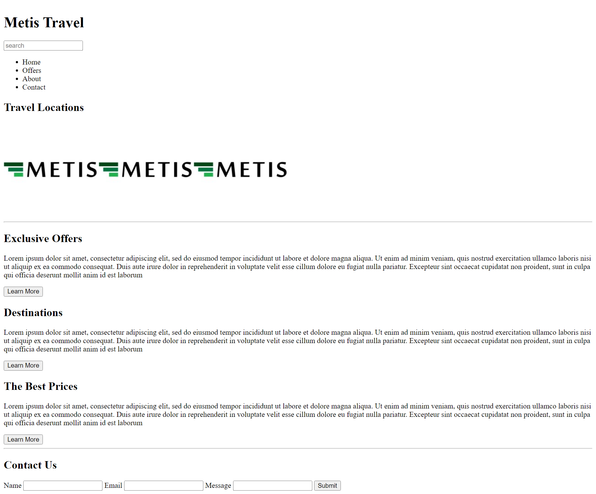

# metis-university-exercises

An implementation of all metis university exercises

1. HTML Exercise
   In this exercise, I have created HTML for the page in Front-end Wireframe Mockup Implementation Training Project. Since this exercise is centered around HTML, the result doesn't have any styling or interactivity.

Output:

2. CSS Exercise
   In this exercise, I have created CSS for the HTML page that I created earlier (from Front-end Wireframe Mockup Implementation Training Project). Since this exercise is centered around CSS, the result has positioned elements and some styling applied.

Output:

3. Bootstrap Exercise
   In this exercise, I have used the Bootstrap grid and controls learned in this course to complete the Front-end Wireframe Mockup Implementation Training Project. The project is completed only by using HTML and Bootstrap elements, custom CSS wasn't used for this project.

Output:

